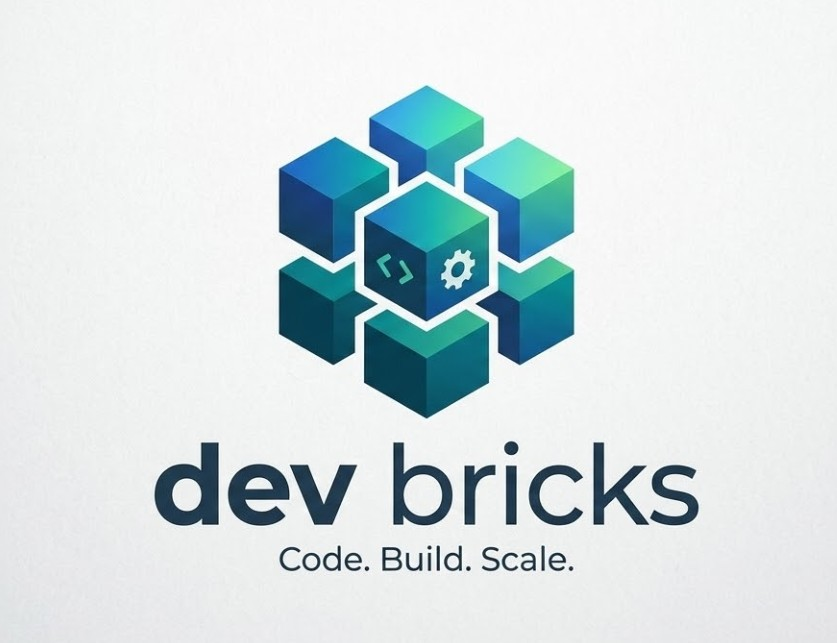

  

# dev-bricks

**Local-first developer tools for Windows, Python, code analysis, API discovery, and Codex maintenance.**

dev-bricks builds small, practical tools for software-development workflows: editing code, analyzing projects, probing owned APIs, and keeping local developer workspaces understandable without depending on heavy cloud platforms.

## Start Here

| Need | Project |
|---|---|
| Developer dashboard for local projects and build workflows | [DevCenter](https://github.com/dev-bricks/DevCenter) |
| Desktop code editor with LSP diagnostics and terminal support | [CodeBox](https://github.com/dev-bricks/CodeBox) |
| Lightweight Python IDE with debugger, linting, and Git status | [pythonbox](https://github.com/dev-bricks/pythonbox) |
| Passive REST API discovery for owned or authorized services | [apiprober](https://github.com/dev-bricks/apiprober) |
| Static Python analysis for imports, dead definitions, and similar blocks | [MethodenAnalyser](https://github.com/dev-bricks/MethodenAnalyser) |
| Controlled startup gate for Codex Desktop automations | [safe-start-for-codex](https://github.com/dev-bricks/safe-start-for-codex) |
| Local maintenance tray and CLI for OpenAI Codex Desktop | [CareCenter-for-Codex](https://github.com/dev-bricks/CareCenter-for-Codex) |

## Public Repository Directory

| Repository | Role |
|---|---|
| [DevCenter](https://github.com/dev-bricks/DevCenter) | Local-first Python IDE and developer toolkit with project dashboards, static analysis, PyInstaller workflows, and optional AI-assisted coding |
| [CodeBox](https://github.com/dev-bricks/CodeBox) | PySide6 desktop code editor with LSP diagnostics, terminal workflows, project navigation, Git integration, and multi-language support |
| [pythonbox](https://github.com/dev-bricks/pythonbox) | Lightweight Windows Python IDE with PDB debugging, linting, code folding, Git status, and local execution workflows |
| [apiprober](https://github.com/dev-bricks/apiprober) | Passive REST API discovery, endpoint inventory, and OpenAPI-oriented documentation for owned or explicitly authorized services |
| [MethodenAnalyser](https://github.com/dev-bricks/MethodenAnalyser) | Static Python analyzer for unused imports, dead definitions, similar code blocks, AST structure, and JSON-exportable findings |
| [safe-start-for-codex](https://github.com/dev-bricks/safe-start-for-codex) | Unofficial Windows startup gate for Codex Desktop automations; pauses active automations, launches Codex Desktop, and releases them gradually |
| [CareCenter-for-Codex](https://github.com/dev-bricks/CareCenter-for-Codex) | Local Windows tray and CLI for OpenAI Codex Desktop repair, cleanup, diagnostics, and safe maintenance |
| [.github](https://github.com/dev-bricks/.github) | Organization profile, shared issue templates, security policy, contribution guidance, and machine-readable repository context |

## Project Families

| Family | Repositories | Focus |
|---|---|---|
| Desktop IDEs | [DevCenter](https://github.com/dev-bricks/DevCenter), [CodeBox](https://github.com/dev-bricks/CodeBox), [pythonbox](https://github.com/dev-bricks/pythonbox) | Local PySide6 developer interfaces for editing, debugging, project navigation, and build workflows |
| Analysis and discovery | [MethodenAnalyser](https://github.com/dev-bricks/MethodenAnalyser), [apiprober](https://github.com/dev-bricks/apiprober) | Static code inspection and passive API documentation for authorized systems |
| Agent tooling | [safe-start-for-codex](https://github.com/dev-bricks/safe-start-for-codex), [CareCenter-for-Codex](https://github.com/dev-bricks/CareCenter-for-Codex) | Codex Desktop startup gating, repair, cleanup, and local operational support |

## Design Principles

- **Local first:** project data, analysis results, and editor state stay on the user's machine by default.
- **Small tools over platforms:** each repository targets a concrete workflow instead of replacing an entire development stack.
- **Windows pragmatism:** desktop apps prioritize reliable local execution, predictable packaging, and low setup overhead.
- **Clear boundaries:** security-adjacent tools such as API discovery are documented for owned or explicitly authorized services.
- **Readable automation:** scripts, tests, and exports are kept understandable for both humans and LLM-assisted maintenance.

## Search and Discovery

Useful phrases for finding dev-bricks projects on GitHub and external search:

- dev-bricks local-first developer tools
- dev-bricks Python IDE and PySide6 code editor
- dev-bricks static Python analysis
- dev-bricks passive REST API discovery and OpenAPI inventory
- dev-bricks Codex Desktop maintenance
- dev-bricks Safe Start for Codex
- dev-bricks Codex automation startup gate
- dev-bricks Windows developer tools

## Machine-Readable Context

For crawlers and LLM tools, see [`llms.txt`](https://github.com/dev-bricks/.github/blob/main/llms.txt). It lists the canonical repositories, project roles, and preferred search phrases for the dev-bricks organization.

## Ecosystem

dev-bricks is the developer-tool branch of the brick suite:

[open-bricks](https://github.com/open-bricks) · [file-bricks](https://github.com/file-bricks) · [doc-bricks](https://github.com/doc-bricks)

Part of the [ellmos-ai](https://github.com/ellmos-ai) ecosystem.
