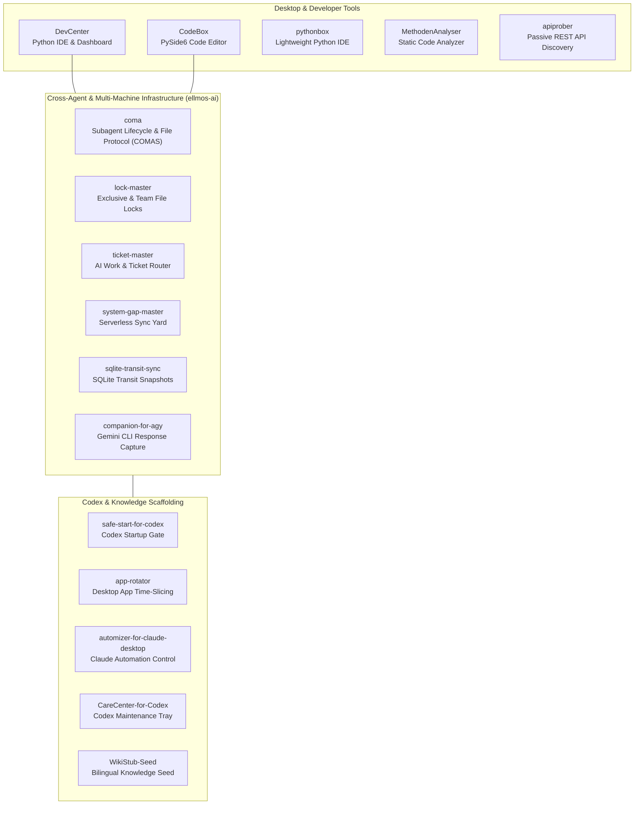

<!-- last-checked: 2026-08-17 -->

  
  
  
  
  

# dev-bricks

**Local-first developer tools for Windows, Python, code analysis, API discovery, Codex maintenance, Gemini CLI integration, subagent lifecycle management, ticket routing, file locking, cross-machine agent sync, and structured LLM workflow scaffolding.**

dev-bricks builds small, practical tools for software-development workflows: editing code, analyzing projects, probing owned APIs, keeping local developer workspaces understandable, and bridging AI agent ecosystems — without depending on heavy cloud platforms.

> [!NOTE]
> Public index checked 2026-08-30 from live GitHub metadata: 11 active repositories (10 active tool repositories + organization profile repository) plus 1 archived repository (`fable-5-hunter`) — 12 public repositories in total. Private or internal work is intentionally excluded from this public directory.

> [!TIP]
> Start with `CodeBox` or `pythonbox` for local IDE work, `apiprober` or `MethodenAnalyser` for project inspection, `coma` for subagent process & file-protocol control, and `lock-master` + `ticket-master` + `system-gap-master` for multi-agent coordination.

## Start Here

| Need | Project |
|---|---|
| Developer dashboard for local projects and build workflows | [DevCenter](https://github.com/dev-bricks/DevCenter) |
| Desktop code editor with LSP diagnostics and terminal support | [CodeBox](https://github.com/dev-bricks/CodeBox) |
| Lightweight Python IDE with debugger, linting, and Git status | [pythonbox](https://github.com/dev-bricks/pythonbox) |
| Passive REST API discovery for owned or authorized services | [apiprober](https://github.com/dev-bricks/ApiProber) |
| Static Python analysis for imports, dead definitions, and similar blocks | [MethodenAnalyser](https://github.com/dev-bricks/MethodenAnalyser) |
| JSON knowledge stubs for research, documentation, learning maps, and LLM context pipelines | [WikiStub-Seed](https://github.com/dev-bricks/WikiStub-Seed) |
| Controlled startup gate for Codex Desktop automations | [safe-start-for-codex](https://github.com/dev-bricks/safe-start-for-codex) |
| Windows tray app that time-slices resource-heavy desktop apps | [app-rotator](https://github.com/dev-bricks/app-rotator) |
| Scheduler and automation-control utility for Claude Desktop | [automizer-for-claude-desktop](https://github.com/dev-bricks/automizer-for-claude-desktop) |
| Local maintenance tray and CLI for OpenAI Codex Desktop | [CareCenter-for-Codex](https://github.com/dev-bricks/CareCenter-for-Codex) |
| Get notified the moment Claude Fable 5 is reachable again in Claude Code *(archived)* | [fable-5-hunter](https://github.com/dev-bricks/fable-5-hunter) |
| Standard-library subagent lifecycle, file protocol & status polling layer (COMAS) | [coma](https://github.com/ellmos-ai/coma) |
| PTY-based wrapper to capture agy (Gemini CLI) responses — [npm](https://www.npmjs.com/package/companion-for-agy) | [companion-for-agy](https://github.com/ellmos-ai/companion-for-agy) |
| Triage console for bugs, requests, tickets, and local AI-provider work routing | [ticket-master](https://github.com/ellmos-ai/ticket-master) |
| Portable multi-agent file-lock system with Exclusive + Team Locks, scopes, expiry, cloud-sync, and stale-cleanup | [lock-master](https://github.com/ellmos-ai/lock-master) |
| Serverless cross-machine sync yard for multi-agent setups — slot rule, gated daily ritual, bootstrap runbook | [system-gap-master](https://github.com/ellmos-ai/system-gap-master) |
| Keep several machines' SQLite databases in step without a server — verified snapshots + merge policies | [sqlite-transit-sync](https://github.com/ellmos-ai/sqlite-transit-sync) |

## Repository Directory

### dev-bricks Tools & Profile

| Repository | Role |
|---|---|
| [DevCenter](https://github.com/dev-bricks/DevCenter) | Local-first Python IDE and developer toolkit with project dashboards, static analysis, PyInstaller workflows, and optional AI-assisted coding |
| [CodeBox](https://github.com/dev-bricks/CodeBox) | PySide6 desktop code editor with LSP diagnostics, terminal workflows, project navigation, Git integration, and multi-language support |
| [pythonbox](https://github.com/dev-bricks/pythonbox) | Lightweight Windows Python IDE with PDB debugging, linting, code folding, Git status, and local execution workflows |
| [apiprober](https://github.com/dev-bricks/ApiProber) | Passive REST API discovery, endpoint inventory, and OpenAPI-oriented documentation for owned or explicitly authorized services |
| [MethodenAnalyser](https://github.com/dev-bricks/MethodenAnalyser) | Static Python analyzer for unused imports, dead definitions, similar code blocks, AST structure, and JSON-exportable findings |
| [WikiStub-Seed](https://github.com/dev-bricks/WikiStub-Seed) | Local-first bilingual JSON knowledge framework with 630+ DE/EN stubs, prepared ES/ZH/JA/RU language slots, Markdown export, and PWA-ready data scaffolding for AI research, documentation, ontology seeds, and LLM workflows |
| [safe-start-for-codex](https://github.com/dev-bricks/safe-start-for-codex) | Unofficial Windows startup gate for Codex Desktop automations; pauses active automations, launches Codex Desktop, and releases them gradually |
| [app-rotator](https://github.com/dev-bricks/app-rotator) | Windows tray application that time-slices resource-heavy desktop apps: runs exactly one configured app at a time, closes it after its slot, and continues in configured order (MIT) |
| [automizer-for-claude-desktop](https://github.com/dev-bricks/automizer-for-claude-desktop) | Unofficial tool for reliably creating and changing planned Claude Desktop tasks from inside the app, from outside it, or while the app is closed |
| [CareCenter-for-Codex](https://github.com/dev-bricks/CareCenter-for-Codex) | Local Windows tray and CLI for OpenAI Codex Desktop repair, cleanup, diagnostics, and safe maintenance |
| [fable-5-hunter](https://github.com/dev-bricks/fable-5-hunter) *(archived)* | Zero-dependency watcher that polls the Claude Code CLI for Claude Fable 5 and notifies you the moment it is reachable again — via Telegram, Discord, ntfy, desktop toast, or file fallback |
| [.github](https://github.com/dev-bricks/.github) | Organization profile, shared issue templates, community workflows, security policy, contribution guidance, and machine-readable repository context |

## Current Public Activity

| Repository | Latest public push | Focus |
|---|---:|---|
| [app-rotator](https://github.com/dev-bricks/app-rotator) | 2026-08-30 | Desktop app time-slicing (first public release v0.2.0) |
| [safe-start-for-codex](https://github.com/dev-bricks/safe-start-for-codex) | 2026-08-16 | Codex Desktop startup gating |
| [automizer-for-claude-desktop](https://github.com/dev-bricks/automizer-for-claude-desktop) | 2026-08-16 | Claude Desktop scheduled-task automation |
| [WikiStub-Seed](https://github.com/dev-bricks/WikiStub-Seed) | 2026-08-16 | Structured JSON/Markdown knowledge stubs |
| [MethodenAnalyser](https://github.com/dev-bricks/MethodenAnalyser) | 2026-08-16 | Static Python code analysis |
| [DevCenter](https://github.com/dev-bricks/DevCenter) | 2026-08-16 | Local-first developer dashboard and IDE |
| [CodeBox](https://github.com/dev-bricks/CodeBox) | 2026-08-16 | PySide6 desktop code editor |

### Integrated ellmos-ai Infrastructure

| Repository | Role |
|---|---|
| [coma](https://github.com/ellmos-ai/coma) | Communication for Autonomous Subagents (COMAS): zero-dependency Python standard-library lifecycle, file protocol, status polling, and agent coordination layer |
| [companion-for-agy](https://github.com/ellmos-ai/companion-for-agy) — [npm](https://www.npmjs.com/package/companion-for-agy) | PTY-based wrapper for agy (Gemini CLI) that captures responses via ANSI color extraction; enables Claude Code, Codex, and CI/CD to read agy output |
| [ticket-master](https://github.com/ellmos-ai/ticket-master) | Cross-platform, multi-provider ticket router; type a bug or request into a triage console, it is filed as a structured ticket, scored, and routed to the right AI provider or sub-agent |
| [lock-master](https://github.com/ellmos-ai/lock-master) | Portable multi-agent file-lock system — Exclusive and Team Locks (LOCK*.txt) with scopes, expiry, cloud-sync support, stale-cleanup and a fast overview cache |
| [system-gap-master](https://github.com/ellmos-ai/system-gap-master) | Serverless "sync yard" (sync-master) for people who run several machines and several AI agents — slot-per-host write ownership, a gated daily sync ritual, message channels, agent-rule snapshots, and a bootstrap runbook |
| [sqlite-transit-sync](https://github.com/ellmos-ai/sqlite-transit-sync) | User-neutral SQLite sync over verified transit snapshots and per-table merge policies (row-level last-write-wins) — companion to system-gap-master, zero dependencies |

## Tool Showcase

The banners are the links; details in the tables above and below:

## Project Families

| Family | Repositories | Focus |
|---|---|---|
| Desktop IDEs | [DevCenter](https://github.com/dev-bricks/DevCenter), [CodeBox](https://github.com/dev-bricks/CodeBox), [pythonbox](https://github.com/dev-bricks/pythonbox) | Local PySide6 developer interfaces for editing, debugging, project navigation, and build workflows |
| Analysis and discovery | [MethodenAnalyser](https://github.com/dev-bricks/MethodenAnalyser), [apiprober](https://github.com/dev-bricks/ApiProber) | Static code inspection and passive API documentation for authorized systems |
| Agent tooling & Support | [safe-start-for-codex](https://github.com/dev-bricks/safe-start-for-codex), [app-rotator](https://github.com/dev-bricks/app-rotator), [automizer-for-claude-desktop](https://github.com/dev-bricks/automizer-for-claude-desktop), [CareCenter-for-Codex](https://github.com/dev-bricks/CareCenter-for-Codex), [fable-5-hunter](https://github.com/dev-bricks/fable-5-hunter) *(archived)* | Codex Desktop startup gating, Claude Desktop automation control, Codex repair and cleanup, local operational support, and Claude model availability monitoring (archived) |
| Knowledge scaffolding | [WikiStub-Seed](https://github.com/dev-bricks/WikiStub-Seed) | Structured JSON and Markdown seed data for documentation glossaries, learning maps, ontology seeds, local RAG, and LLM context pipelines |
| Cross-agent infrastructure | [coma](https://github.com/ellmos-ai/coma), [lock-master](https://github.com/ellmos-ai/lock-master), [ticket-master](https://github.com/ellmos-ai/ticket-master), [system-gap-master](https://github.com/ellmos-ai/system-gap-master), [sqlite-transit-sync](https://github.com/ellmos-ai/sqlite-transit-sync), [companion-for-agy](https://github.com/ellmos-ai/companion-for-agy) | The coordination and lifecycle layer for multi-agent, multi-machine setups: subagent process & file-protocol control, portable file locking, ticket routing, serverless cross-machine file and database sync, and Gemini CLI response capture |

## Architecture Overview

## Design Principles

- **Local first:** project data, analysis results, and editor state stay on the user's machine by default.
- **Small tools over platforms:** each repository targets a concrete workflow instead of replacing an entire development stack.
- **Windows pragmatism:** desktop apps prioritize reliable local execution, predictable packaging, and low setup overhead.
- **Clear boundaries:** security-adjacent tools such as API discovery are documented for owned or explicitly authorized services.
- **Readable automation:** scripts, tests, and exports are kept understandable for both humans and LLM-assisted maintenance.

## Search and Discovery

Useful phrases for finding dev-bricks projects on GitHub and external search:

- dev-bricks local-first developer tools
- dev-bricks Python IDE and PySide6 code editor
- dev-bricks coma subagent lifecycle
- dev-bricks coma communication for autonomous subagents
- dev-bricks subagent file protocol status polling
- dev-bricks static Python analysis
- dev-bricks passive REST API discovery and OpenAPI inventory
- dev-bricks Codex Desktop maintenance
- dev-bricks Safe Start for Codex
- dev-bricks Codex automation startup gate
- dev-bricks automizer for Claude Desktop
- dev-bricks Claude Desktop scheduled tasks automation
- dev-bricks companion for agy Gemini CLI wrapper
- dev-bricks Claude Fable 5 availability watcher for Claude Code
- dev-bricks ticket-master AI ticket routing
- dev-bricks local AI work routing
- dev-bricks multi-agent orchestration tools
- dev-bricks lock-master multi-agent file locking
- dev-bricks system-gap-master serverless sync yard
- dev-bricks sync-master cross-machine agent sync
- dev-bricks sqlite-transit-sync serverless SQLite sync
- dev-bricks SQLite transit snapshots row-level merge policies
- dev-bricks serverless sync yard for AI agents
- dev-bricks cross-agent infrastructure lock ticket sync
- dev-bricks WikiStub-Seed JSON knowledge framework
- dev-bricks multilingual knowledge stubs
- dev-bricks LLM knowledge base seed
- dev-bricks ontology seed dataset
- dev-bricks Windows developer tools

## Machine-Readable Context

For crawlers and LLM tools, see [`llms.txt`](https://github.com/dev-bricks/.github/blob/main/llms.txt). It lists the canonical repositories, project roles, and preferred search phrases for the dev-bricks organization.

## Ecosystem

dev-bricks is the developer-tool branch of the brick suite:

[open-bricks](https://github.com/open-bricks) — [file-bricks](https://github.com/file-bricks) — [doc-bricks](https://github.com/doc-bricks)

Part of the [ellmos-ai](https://github.com/ellmos-ai) ecosystem.

<!-- last-checked: 2026-08-17 -->
