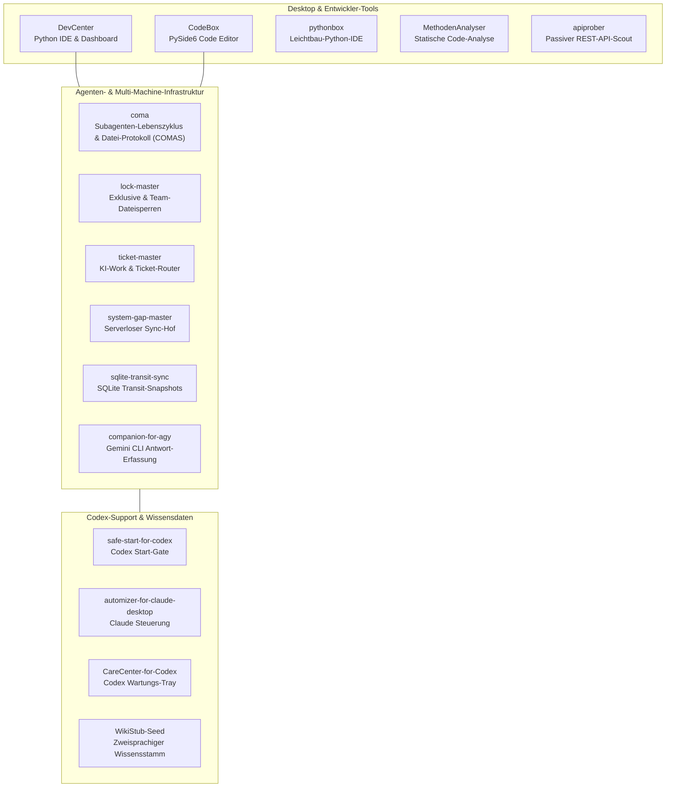

<!-- last-checked: 2026-07-28 -->

  
  
  
  
  

# dev-bricks

**Lokale Entwicklerwerkzeuge für Windows, Python, Code-Analyse, API-Erkundung, Subagenten-Lebenszyklus, Codex-Wartung, Gemini-CLI-Integration, Ticket-Routing, Dateisperren, maschinenübergreifenden Agenten-Sync und strukturierte LLM-Kontext-Pipeline-Scaffolding.**

dev-bricks entwickelt kompakte, praktische Software für tägliche Entwicklungsabläufe: Code editieren, Projekte analysieren, eigene APIs dokumentieren, lokale Entwicklerumgebungen übersichtlich halten und KI-Agenten-Ökosysteme verbinden — ohne Abhängigkeit von komplexen Cloud-Plattformen.

> [!NOTE]
> **Öffentlicher Verzeichnisstand:**
> Geprüft am 28.07.2026 anhand der Live-GitHub-Metadaten: 17 aktive Repositories (16 Werkzeug-Repositories + Organisations-Profil-Repository) sowie 1 archiviertes Repository (`fable-5-hunter`). Private und interne Arbeiten sind in diesem öffentlichen Index bewusst ausgeschlossen.

> [!TIP]
> **Einstiegsempfehlung:**
> Starten Sie mit `CodeBox` oder `pythonbox` für lokale IDE-Arbeit, `apiprober` oder `MethodenAnalyser` für Projektinspektion, `coma` für Subagenten-Prozess- & Datei-Protokoll-Steuerung sowie `lock-master` + `ticket-master` + `system-gap-master` für die Koordination mehrerer KI-Agenten.

## Hier Starten

| Anforderung / Ziel | Projekt | Warum |
|---|---|---|
| Entwickler-Dashboard für lokale Projekte & Build-Pipelines | [DevCenter](https://github.com/dev-bricks/DevCenter) | PySide6-Desktop-Umgebung für Projektübersichten, statische Analyse, PyInstaller-Workflows und optionale KI-Code-Assistenz |
| Desktop-Code-Editor mit LSP-Diagnose & Terminal | [CodeBox](https://github.com/dev-bricks/CodeBox) | PySide6-Editor mit Sprach-Server-Anbindung, Git-Status und integriertem Terminal |
| Leichtbau-Python-IDE mit Debugger & Linting | [pythonbox](https://github.com/dev-bricks/pythonbox) | Schlanke Windows-IDE mit PDB-Debugging, Code-Folding und lokaler Ausführung |
| Passive REST-API-Erkundung für eigene Dienste | [apiprober](https://github.com/dev-bricks/apiprober) | Werkzeug für API-Inventarisierung, Endpunkt-Dokumentation und OpenAPI-Vorlagen |
| Statische Code-Analyse für Python-Projekte | [MethodenAnalyser](https://github.com/dev-bricks/MethodenAnalyser) | Findet ungenutzte Imports, tote Definitionen, ähnliche Blöcke und liefert JSON-Analysen |
| Strukturierter JSON-Wissensdaten-Stamm für RAG & LLMs | [WikiStub-Seed](https://github.com/dev-bricks/WikiStub-Seed) | Zweisprachiger Wissensstamm mit 630+ DE/EN-Stubs für Forschung, Dokumentation und KI-Kontexte |
| Standardbibliotheks-Subagenten-Lebenszyklus & Datei-Protokoll (COMAS) | [coma](https://github.com/dev-bricks/coma) | Null-Abhängigkeiten Python-Schicht für Spawn, Datei-Protokoll-IPC, Status-Polling und Prozessisolierung |
| agy / Gemini CLI Antwort-Erfassung im Terminal · [npm](https://www.npmjs.com/package/companion-for-agy) | [companion-for-agy](https://github.com/dev-bricks/companion-for-agy) | PTY-Wrapper für ANSI-Farbauslesung aus Gemini-CLI-Ausgaben für Claude Code & Codex |
| Kontrollierter Start-Gate für Codex Desktop Automationen | [safe-start-for-codex](https://github.com/dev-bricks/safe-start-for-codex) | Pausiert lokale Automationen beim Codex-Start und gibt sie gestaffelt frei |
| Aufgaben-Planer & Steuerung für Claude Desktop | [automizer-for-claude-desktop](https://github.com/dev-bricks/automizer-for-claude-desktop) | Zuverlässiges Erstellen und Ändern geplanter Aufgaben für Claude Desktop |
| Lokales Wartungs-Tray & CLI für OpenAI Codex Desktop | [CareCenter-for-Codex](https://github.com/dev-bricks/CareCenter-for-Codex) | Diagnose, Bereinigung, Log-Wartung und Reparatur für Codex Desktop auf Windows |
| Modell-Verfügbarkeits-Überwachung für Claude Fable 5 *(archiviert)* | [fable-5-hunter](https://github.com/dev-bricks/fable-5-hunter) | Zero-Dependency-Watcher für die Claude Code CLI zur Erreichbarkeits-Benachrichtigung |
| Triage-Konsole & Ticket-Router für lokale KI-Provider | [ticket-master](https://github.com/dev-bricks/ticket-master) | Erfasst Fehler und Anfragen als strukturierte Tickets und leitet sie an KI-Agenten weiter |
| Portables Multi-Agenten-Dateisperrsystem | [lock-master](https://github.com/dev-bricks/lock-master) | Exklusive und Team-Sperren (LOCK*.txt) mit Ablaufzeit, Cloud-Sync-Support und Stale-Cleanup |
| Serverloser Cross-Machine-Sync-Hof für KI-Agenten | [system-gap-master](https://github.com/dev-bricks/system-gap-master) | Host-Schreibrechte-Regel, tägliches Sync-Ritual, Nachrichten-Kanäle und Bootstrap-Runbook |
| Serverloser SQLite-Datenbank-Abgleich über Devices | [sqlite-transit-sync](https://github.com/dev-bricks/sqlite-transit-sync) | SQLite-Sync via verifizierten Transit-Snapshots und Zeilen-Merge-Policen ohne Datenbank-Server |

## Repository-Verzeichnis

| Repository | Rolle | Status |
|---|---|---|
| [DevCenter](https://github.com/dev-bricks/DevCenter) | Lokale Python-IDE und Entwickler-Toolkit mit Dashboards, statischer Analyse und PyInstaller-Workflows | Aktiv |
| [CodeBox](https://github.com/dev-bricks/CodeBox) | PySide6 Desktop-Code-Editor mit LSP-Diagnose, Terminal, Projektnavigation und Git-Anbindung | Aktiv |
| [pythonbox](https://github.com/dev-bricks/pythonbox) | Schlanke Windows-Python-IDE mit PDB-Debugging, Linting, Code-Folding und lokaler Ausführung | Aktiv |
| [apiprober](https://github.com/dev-bricks/apiprober) | Passiver REST-API-Scout, Endpunkt-Inventar und OpenAPI-orientierte Dokumentation für berechtigte Dienste | Aktiv |
| [MethodenAnalyser](https://github.com/dev-bricks/MethodenAnalyser) | Statischer Python-Analysator für tote Definitionen, ungenutzte Imports und AST-Strukturen | Aktiv |
| [WikiStub-Seed](https://github.com/dev-bricks/WikiStub-Seed) | Zweisprachiger JSON-Wissensrahmen mit 630+ DE/EN-Stubs für KI-Forschung, Dokumentation und RAG-Pipelines | Aktiv |
| [coma](https://github.com/dev-bricks/coma) | Communication for Autonomous Subagents (COMAS): Null-Abhängigkeiten Lebenszyklus-, Datei-Protokoll- & Status-Polling-Schicht | Aktiv |
| [companion-for-agy](https://github.com/dev-bricks/companion-for-agy) | PTY-Wrapper für agy (Gemini CLI) zur programmierten Auslesung von Terminal-Antworten | Aktiv |
| [safe-start-for-codex](https://github.com/dev-bricks/safe-start-for-codex) | Start-Gate für Codex-Desktop-Automationen zur Vermeidung von Lastspitzen beim Systemstart | Aktiv |
| [automizer-for-claude-desktop](https://github.com/dev-bricks/automizer-for-claude-desktop) | Werkzeug für das Steuern und Ändern geplanter Claude Desktop Aufgaben | Aktiv |
| [CareCenter-for-Codex](https://github.com/dev-bricks/CareCenter-for-Codex) | Windows-Tray und CLI für Reparatur, Diagnose und Log-Bereinigung von OpenAI Codex Desktop | Aktiv |
| [fable-5-hunter](https://github.com/dev-bricks/fable-5-hunter) | Benachrichtigungs-Watcher für die Erreichbarkeit von Claude Fable 5 in Claude Code *(archiviert)* | Archiviert |
| [ticket-master](https://github.com/dev-bricks/ticket-master) | Triage-Konsole und Ticket-Router zur Verteilung von Aufgaben an Claude, Codex, Gemini oder Subagenten | Aktiv |
| [lock-master](https://github.com/dev-bricks/lock-master) | Portables Dateisperrsystem für Multi-Agenten-Setups mit Exklusiv- & Team-Locks | Aktiv |
| [system-gap-master](https://github.com/dev-bricks/system-gap-master) | Serverloser Sync-Hof (sync-master) für mehrere Maschinen und KI-Agenten mit daily sync ritual und Bootstrap-Runbook | Aktiv |
| [sqlite-transit-sync](https://github.com/dev-bricks/sqlite-transit-sync) | SQLite-Datenbank-Sync über Transit-Snapshots und Zeilen-Merge-Regeln ohne Server | Aktiv |
| [.github](https://github.com/dev-bricks/.github) | Organisationsprofil, Vorlagen für Issues/PRs, Community-Workflows und maschinenlesbarer Index | Aktiv |

## Projektfamilien

| Familie | Repositories | Schwerpunkt |
|---|---|---|
| Desktop-IDEs | [DevCenter](https://github.com/dev-bricks/DevCenter), [CodeBox](https://github.com/dev-bricks/CodeBox), [pythonbox](https://github.com/dev-bricks/pythonbox) | Lokale PySide6-Entwickleroberflächen für Code-Editierung, Debugging und Build-Abläufe |
| Analyse & Discovery | [MethodenAnalyser](https://github.com/dev-bricks/MethodenAnalyser), [apiprober](https://github.com/dev-bricks/apiprober) | Statische Code-Inspektion und passive API-Dokumentation für autorisierte Systeme |
| Agenten-Infrastruktur | [coma](https://github.com/dev-bricks/coma), [lock-master](https://github.com/dev-bricks/lock-master), [ticket-master](https://github.com/dev-bricks/ticket-master), [system-gap-master](https://github.com/dev-bricks/system-gap-master), [sqlite-transit-sync](https://github.com/dev-bricks/sqlite-transit-sync), [companion-for-agy](https://github.com/dev-bricks/companion-for-agy) | Die Koordinations- & Lebenszyklus-Schicht für Multi-Agenten-Teams: Subagenten-Steuerung & Datei-Protokoll, Dateisperren, Ticket-Routing, serverloser Datei- und DB-Sync sowie Gemini-CLI-Auslesung |
| Agenten-Tools & Support | [safe-start-for-codex](https://github.com/dev-bricks/safe-start-for-codex), [automizer-for-claude-desktop](https://github.com/dev-bricks/automizer-for-claude-desktop), [CareCenter-for-Codex](https://github.com/dev-bricks/CareCenter-for-Codex), [fable-5-hunter](https://github.com/dev-bricks/fable-5-hunter) *(archiviert)* | Codex-Start-Gating, Claude-Desktop-Steuerung, Codex-Reparatur und Modell-Monitoring |
| Wissens-Frameworks | [WikiStub-Seed](https://github.com/dev-bricks/WikiStub-Seed) | Strukturierte JSON/Markdown-Stammdaten für Dokumentations-Glossare, RAG und LLM-Pipelines |

## Systemarchitektur

## Entwicklungs-Prinzipien

- **Local-First:** Projektdaten, Analyseergebnisse und Editor-Zustände verbleiben standardmäßig auf dem lokalen Rechner.
- **Spezialisierte Werkzeuge:** Jedes Repo fokussiert sich auf eine konkrete Aufgabe statt komplexe Plattformen zu imitieren.
- **Pragmatische Windows-Unterstützung:** Verlässliche lokale Ausführung, saubere Distribution und minimaler Setup-Aufwand.
- **Transparente Grenzen:** API-Erkundungswerkzeuge sind ausschließlich für eigene oder explizit freigegebene Systeme dokumentiert.
- **Nachvollziehbare Automation:** Skripte, Tests und Exporte sind sowohl für Entwickler als auch für KI-Agenten verständlich strukturiert.

## Maschinenlesbarer Kontext

Für Crawler, Suchmaschinen und LLM-Assistenten steht [`llms.txt`](https://github.com/dev-bricks/.github/blob/main/llms.txt) bereit.

## Ökosystem

dev-bricks ist die Entwickler-Sparte der Bricks-Produktlinie:

[open-bricks](https://github.com/open-bricks) · [file-bricks](https://github.com/file-bricks) · [doc-bricks](https://github.com/doc-bricks)

Teil des [ellmos-ai](https://github.com/ellmos-ai) Ökosystems.

<!-- last-checked: 2026-07-28 -->
